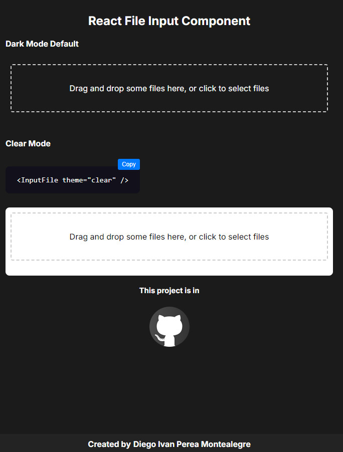

# React File Input Component

<p align="justify">
React File Input Component in which you can Drag and drop files or select files and you can see a visualization of files like photos, pdf, .docx and .xlsx
</p>


<p align="center">
  
</p>

Clear mode
<p align="center">
  
</p>


Visualization files 
Photos
<p align="center">
  
</p>
PDF
<p align="center">
  
</p>
WORD
<p align="center">
  
</p>
Excel
<p align="center">
  
</p>

Home
<p align="center">
  
</p>

-----

### Steps For use the Component 
1. Create un file InputFile.jsx
2. Copy code of the Component InputFile and page it

```jsx
      "use client";
    import React, { useState, useCallback } from 'react';
    import { useDropzone } from 'react-dropzone';
    import { FaFilePdf, FaFileWord, FaFileExcel, FaFileImage, FaTimes } from 'react-icons/fa';
    import * as XLSX from 'xlsx';
    import mammoth from 'mammoth';

    const InputFile = ({ theme = "dark" }) => {
      const [files, setFiles] = useState([]);
      const [selectedFile, setSelectedFile] = useState(null);
      const [fileContent, setFileContent] = useState({});
      const [showPreview, setShowPreview] = useState(false);

      const isDarkTheme = theme !== "clear";

      const themeStyles = {
        dark: {
          backgroundColor: '#1b1b1b',
          color: 'white',
          borderColor: '#ccc',
        },
        clear: {
          backgroundColor: 'white',
          color: 'black',
          borderColor: '#ccc',
        }
      };

      const currentTheme = isDarkTheme ? themeStyles.dark : themeStyles.clear;
      
      const onDrop = useCallback((acceptedFiles) => {
        const newFiles = acceptedFiles.map((file) => ({
          file,
          preview: URL.createObjectURL(file),
        }));

        const fileReaders = newFiles.map(({ file }) => {
          return new Promise((resolve, reject) => {
            const reader = new FileReader();
            reader.onload = () => {
              resolve({
                name: file.name,
                base64: reader.result,
                type: file.type,
              });
            };
            reader.onerror = reject;
            reader.readAsDataURL(file);
          });
        });

        Promise.all(fileReaders).then((newAttachments) => {
          setFiles((prevFiles) => [...prevFiles, ...newAttachments]);
        });
      }, []);

      const { getRootProps, getInputProps, isDragActive } = useDropzone({ onDrop });

      const removeFile = (file) => {
        const newFiles = files.filter((f) => f !== file);
        setFiles(newFiles);
        if (selectedFile === file) {
          setSelectedFile(null);
        }
      };

      const renderFilePreview = (file, isLarge = false) => {
        const extension = file.name.split('.').pop().toLowerCase();
        const size = isLarge ? 100 : 50;

        switch (extension) {
          case 'jpg':
          case 'jpeg':
          case 'png':
          case 'gif':
            return <FaFileImage size={size} color="#4CAF50" />;
          case 'pdf':
            return <FaFilePdf size={size} color="#FF0000" />;
          case 'doc':
          case 'docx':
            return <FaFileWord size={size} color="#2B579A" />;
          case 'xlsx':
          case 'csv':
            return <FaFileExcel size={size} color="#217346" />;
          default:
            return null;
        }
      };

      const handleFileClick = (file) => {
        handlePreview(file);
      };

      const formatFileSize = (bytes) => {
        if (bytes === 0) return '0 Bytes';
        const k = 1024;
        const sizes = ['Bytes', 'KB', 'MB', 'GB', 'TB'];
        const i = Math.floor(Math.log(bytes) / Math.log(k));
        return parseFloat((bytes / Math.pow(k, i)).toFixed(2)) + ' ' + sizes[i];
      };

      const handlePreview = async (attachment) => {
        if (attachment.type === 'application/vnd.openxmlformats-officedocument.wordprocessingml.document') {
          try {
            const arrayBuffer = convertDataURIToBinary(attachment.base64);
            const result = await mammoth.convertToHtml({ arrayBuffer });
            setFileContent({ ...attachment, htmlContent: result.value });
          } catch (error) {
            console.error("Error processing Word file:", error);
            alert("Error processing Word file. Please try again.");
          }
        } else if (attachment.type === 'application/vnd.openxmlformats-officedocument.spreadsheetml.sheet') {
          try {
            const arrayBuffer = convertDataURIToBinary(attachment.base64);
            const workbook = XLSX.read(arrayBuffer, { type: 'array' });
            const htmlString = workbook.SheetNames.map((sheetName) => {
              const sheet = workbook.Sheets[sheetName];
              return XLSX.utils.sheet_to_html(sheet, { editable: false });
            }).join('');
            setFileContent({ ...attachment, htmlContent: htmlString });
          } catch (error) {
            console.error("Error processing Excel file:", error);
            alert("Error processing Excel file. Please try again.");
          }
        } else {
          setFileContent(attachment);
        }
        setShowPreview(true);
        setSelectedFile(attachment);
      };

      const convertDataURIToBinary = (dataURI) => {
        const base64Index = dataURI.indexOf(';base64,') + ';base64,'.length;
        const base64 = dataURI.substring(base64Index);
        const raw = atob(base64);
        const rawLength = raw.length;
        const array = new Uint8Array(new ArrayBuffer(rawLength));

        for (let i = 0; i < rawLength; i++) {
          array[i] = raw.charCodeAt(i);
        }
        return array.buffer;
      };
      const utf8_to_b64 = (str) => {
        return window.btoa(unescape(encodeURIComponent(str)));
      };

      const renderPreviewContent = () => {
        const commonStyle = {
          width: "100%",
          height: "80vh", // Esto hará que ocupe el 80% de la altura de la ventana
          maxWidth: "90vw", // Esto limitará el ancho al 90% del ancho de la ventana
          objectFit: "contain"
        };
      
        if (fileContent.type.startsWith("image/")) {
          return ;
        }
        if (fileContent.type === 'application/pdf') {
          return (
            <iframe
              src={fileContent.base64}
              style={commonStyle}
              title="PDF file"
            />
          );
        }
      
        if (fileContent.type === 'application/vnd.openxmlformats-officedocument.spreadsheetml.sheet') {
          return (
            <iframe
              src={`data:text/html;base64,${utf8_to_b64(fileContent.htmlContent)}`}
              style={commonStyle}
              title="Excel file"
            />
          );
        }
        if (fileContent.type === 'application/vnd.openxmlformats-officedocument.wordprocessingml.document') {
          return (
            <iframe
              src={`data:text/html;base64,${utf8_to_b64(fileContent.htmlContent)}`}
              style={commonStyle}
              title="Word file"
            />
          );
        }
      
        return <div>Cannot preview this type of file</div>;
      };

      return (
        <div style={{ 
          backgroundColor: currentTheme.backgroundColor, 
          color: currentTheme.color,
          borderRadius: '8px',
          padding: '10px'
        }}>
          <div {...getRootProps()} style={{
            border: `2px dashed ${currentTheme.borderColor}`,
            borderRadius: '4px',
            padding: '20px',
            textAlign: 'center',
            cursor: 'pointer'
          }}>
            <input {...getInputProps()} />
            {
              isDragActive ?
                <p>Drop the files here...</p> :
                <p>Drag and drop some files here, or click to select files</p>
            }
          </div>
          <div style={{ display: 'flex', flexWrap: 'wrap', marginTop: '20px' }}>
            {files.map((file) => (
              <div key={file.name} style={{ margin: '10px', position: 'relative', cursor: 'pointer' ,background: isDarkTheme ? '#4b4646' : ' rgb(249 249 249)',padding: '10px',borderRadius: '8px'}} onClick={() => handleFileClick(file)}>
                {renderFilePreview(file)}
                <button
                  onClick={(e) => { e.stopPropagation(); removeFile(file); }}
                  style={{
                    position: 'absolute',
                    top: '-10px',
                    right: '-10px',
                    background: 'red',
                    color: 'white',
                    border: 'none',
                    borderRadius: '50%',
                    width: '20px',
                    height: '20px',
                    display: 'flex',
                    justifyContent: 'center',
                    alignItems: 'center',
                    cursor: 'pointer'
                  }}
                >
                  <FaTimes />
                </button>
                <p>{file.name}</p>
              </div>
            ))}
          </div>
          {selectedFile && showPreview && (
            <div style={{
              position: 'fixed',
              top: '50%',
              left: '50%',
              transform: 'translate(-50%, -50%)',
              background:  'white',
              color:  'black',
              padding: '20px',
              boxShadow: '0 0 10px rgba(0,0,0,0.3)',
              zIndex: 1000,
              width: '90vw', // 90% del ancho de la ventana
              height: '90vh', // 90% de la altura de la ventana
              overflow: 'auto',
              borderRadius: '8px',
            }}>
              <button
                onClick={() => { setSelectedFile(null); setShowPreview(false); }}
                style={{
                  position: 'absolute',
                  top: '10px',
                  right: '10px',
                  background: 'red',
                  color: 'white',
                  border: 'none',
                  borderRadius: '50%',
                  width: '30px',
                  height: '30px',
                  display: 'flex',
                  justifyContent: 'center',
                  alignItems: 'center',
                  cursor: 'pointer'
                }}
              >
                <FaTimes />
              </button>
              <div style={{ display: 'flex', flexDirection: 'column', alignItems: 'center' }}>
                <h3 style={{ color: '#1b1b1b' }}>{selectedFile.name}</h3>
                {/* <p>Tipo: {selectedFile.type || 'Desconocido'}</p>
                <p>Tamaño: {formatFileSize(selectedFile.size)}</p>
                <p>Última modificación: {new Date(selectedFile.lastModified).toLocaleString()}</p> */}
                {renderPreviewContent()} 
              </div>
            </div>
          )}
        </div>
      );
    };

    export default InputFile;
```


 

4. Execute library and run
```bash
set NODE_OPTIONS=--max-old-space-size=4096
npm install react react-dom react-dropzone react-icons xlsx mammoth
npm run dev
```

For put 
##### Theme dark for fault
```jsx
<InputFile /> 
```
<p align="center">
  
</p>

##### Theme clear
```jsx
<InputFile theme="clear" /> 
```
<p align="center">
  
</p>

You can modify the component styles as you wish.

-----

Fronted Nextjs Options for do it:

This is a [Next.js](https://nextjs.org/) project bootstrapped with [`create-next-app`](https://github.com/vercel/next.js/tree/canary/packages/create-next-app).


## Important note!

> [!WARNING]
> Use this code for adjust the amount of memory that Node.js
>
In windows use:
```bash
set NODE_OPTIONS=--max-old-space-size=4096
npm run dev
```
For macOS and Linux
```bash
export NODE_OPTIONS=--max-old-space-size=4096
npm run dev
```

## Getting Started
Nodejs version v20.10.0 and Next.js version v14.2.3 

First
```bash
npm install
```
run the development server:

```bash
npm run dev
# or
yarn dev
# or
pnpm dev
# or
bun dev
```

Open [http://localhost:3000](http://localhost:3000) with your browser to see the result.

## Resolve : Error Nextjs Parsing error: Cannot find module 'next/babel'

Put this code in .eslintrc.json 
```bash
{
  "extends": ["next/babel","next/core-web-vitals"]
}
```


Created by [Diego Ivan Perea Montealegre](https://github.com/diegoperea20)